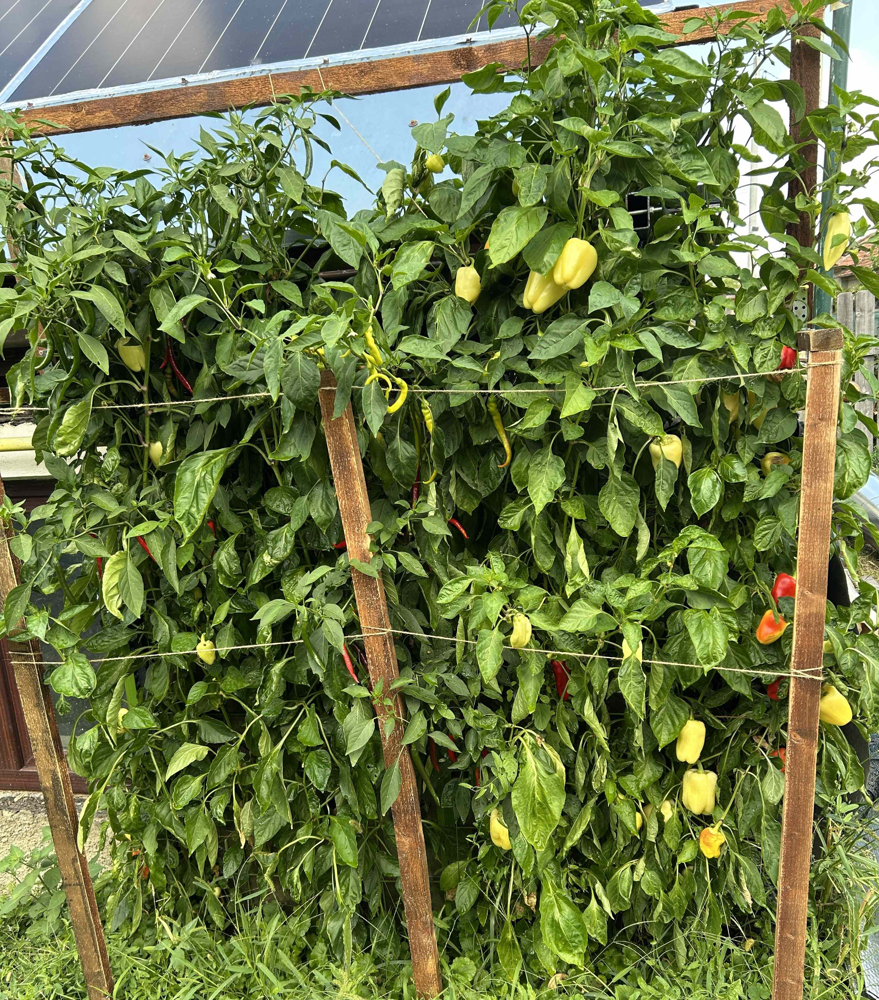

# The Wall Garden

A vegetable garden on the walls of the house.

No pots, just a continuous layer of soil so that roots can grow unrestricted!

The purpose of the __Wall Garden__ is to:

- Grow vegetables directly on the walls.
- Consume less water than a horizontal garden.
- Provide thermal insulation for the house.

# Technical specs

Currently the __Wall Garden__ is built on 3 sections of wall totalizing 6m in length and 1.8m (of soil) in height.

## Maker

[Mihai Oltean](https://mihaioltean.github.io)

## Pictures and videos

[YouTube video](https://www.youtube.com/watch?v=czQobMgsrGs)

[Instagram](https://www.instagram.com/oltean.mihai.nicolae/)

... more soon.

## Project location

Street: **Gh. Lazăr 9**, Town: **Cugir**, Country: **Romania**.

## CAD files

[https://github.com/wall-garden/cad](https://github.com/wall-garden/cad)

## Materials and prices

Prices are specific to my region (Cugir, Romania). I have not searched for better prices from distant stores. Prices do not include shipping (because I purchased the materials from nearby stores and the shipping was free).

Will be updated ...

| Material     | Quantity | Unit |Price per unit (EURO)| Total price | Utilization | Where to buy|
| ----------- | ------- | --- | ------- | ----- | ------ | ------ |
L profile (steel) 30x30mm | 24 | m |  ? | ? | support | local |
welded mesh 6mm| 20 | m^2^ |  ? | ? | plexi support | local |
plexiglass 2mm| 20 | m^2^ |  ? | ? | soil support | local |
screws, nuts, washers (M8)| many | pcs | ? | ? | everywhere | local |

## Tools

- Drill/screwdriver machine. I have a [Milwaukee M18 FDD3](https://www.milwaukeetool.com/).
- Grinding/metal cutting machine. I have a [Milwaukee M18FSAG125X](https://www.milwaukeetool.com/).
- Drill bits.
- Many others...

## Software

- [OpenSCAD](https://openscad.org) - for 3D design.
- [Real Cut 1D](https://optimalprograms.com/realcut1d.htm) - for minimizing the waste when cutting linear materias (bars) (if you have a lot of bars to cut from).

## Build instructions

- Cut the bars to required size,
- Build the mechanical structure,
- Dig holes in plexiglass,
- Plant peppers.

More details will be given here soon ... [instructions.md](instructions.md)

## License

MIT

You may do whatever you want with this information as long as you mention the author.

## Cite as

Mihai Oltean, *A wall garden*, 2026.

## History

- 2026, March. The idea!
- 2026, April (end of). First wall garden built.
- 2026, May. 2nd and 3rd wall gardens built.

## Warning

- I offer *NO warranty* for the information provided in this project!

- I am *NOT an expert* in ANY of the subjects used in the design and construction of this project! 

- Use it, build it, on *your OWN risk*!

- This is a work in progress. Everything might change depending on the experiment results.

## Special thanks to

Dorin Popa, Simona Dumitriu, Maria Oltean, Mihaela Roșu, Nicolae Oltean.